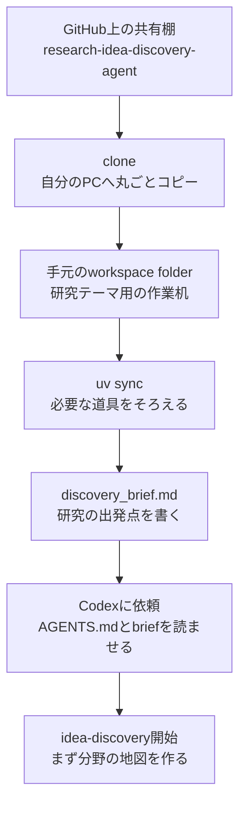
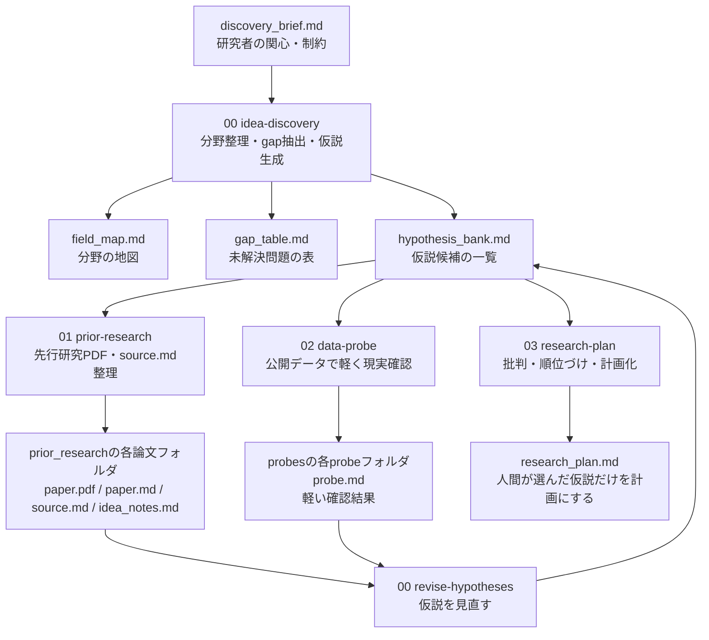
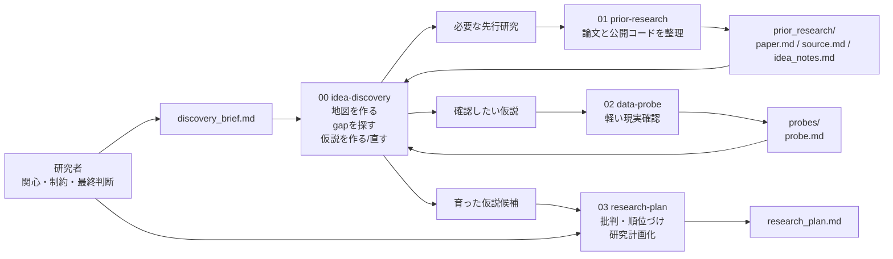
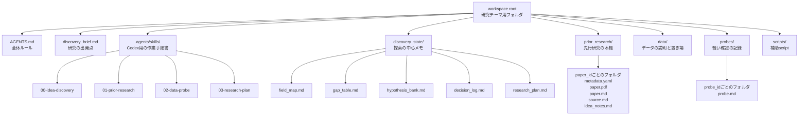

# Cloneして使うための説明書

この説明書は、プログラミングに慣れていない研究者が、GitHubからこのリポジトリを取得し、Codexと一緒に研究アイデア探索を始めるための手順です。

ここで扱うものは、完成済みのアプリではありません。研究テーマを考えるための「作業机一式」です。

たとえるなら、次のようなものです。

- GitHub repository: 研究ノートのひな形が入った共有棚
- clone: 共有棚から自分の机へ、ノート一式を丸ごとコピーすること
- folder: 自分の机の上に置いた研究テーマ用バインダー
- Markdown file: 普通の文章で書ける研究メモ用紙
- Codex: 机の横で一緒に文献整理や仮説整理を手伝う共同作業者
- skill: Codexに渡す作業手順書
- uv: Python道具箱の管理係

## 全体像

最初にやることは、大きく5つです。

```text
1. GitHubからworkspaceをcloneする
2. フォルダに入る
3. uv syncで道具箱をそろえる
4. discovery_brief.mdに研究の出発点を書く
5. CodexにAGENTS.mdとdiscovery_brief.mdを読ませて開始する
```

図にすると、最初の流れは次のようになります。



イメージとしては、空の研究室に入って、机を置き、文房具をそろえ、最初の研究メモを書き、共同研究者に「この方向で一緒に考えて」と依頼する流れです。

## 必要なもの

使う前に、以下が必要です。

```text
Git
uv
Codex
```

それぞれの役割は次の通りです。

| 名前 | 役割 | たとえ |
|---|---|---|
| Git | GitHubからファイル一式を取得する | 共有棚からバインダーをコピーする係 |
| uv | Pythonの必要な道具をそろえる | 実験器具を棚からそろえる係 |
| Codex | 研究メモを読み書きして一緒に考える | 研究補助者 |

すでに入っているかは、Terminalで確認できます。

```bash
git --version
uv --version
```

数字が表示されれば入っています。エラーが出る場合は、Gitまたはuvのインストールが必要です。

## Step 1: Terminalを開く

Terminalは、コンピュータに短い指示を出すための窓です。

普段のFinderやデスクトップ操作が「マウスで本棚を開ける操作」だとすると、Terminalは「本棚の場所を文字で指定する操作」です。

Macなら、Spotlightで次を検索して開きます。

```text
Terminal
```

## Step 2: 置き場所を決める

たとえば、Documentsの中に置くなら、Terminalで次を実行します。

```bash
cd ~/Documents
```

`cd`は「そのフォルダに移動する」という意味です。

たとえるなら、廊下から「Documents」という部屋に入る操作です。

## Step 3: GitHubからcloneする

次を実行します。

```bash
git clone https://github.com/akiyoshi0/research-idea-discovery-agent.git
```

これで、Documentsの中に次のフォルダができます。

```text
research-idea-discovery-agent
```

これは、研究アイデア創出用の作業机一式です。

### 研究テーマごとに別のフォルダ名でcloneする場合

複数の研究テーマで使う場合は、テーマごとに別のフォルダを作るのがおすすめです。

たとえば、化学的摂動応答予測用に使うなら、次のように最後にフォルダ名を付けます。

```bash
git clone https://github.com/akiyoshi0/research-idea-discovery-agent.git perturbation_project
```

この場合、できるフォルダは次です。

```text
perturbation_project
```

たとえるなら、同じ市販ノートを買っても、1冊目は「化学的摂動」、2冊目は「病理画像」、3冊目は「single-cell解析」と表紙に別の名前を書くようなものです。

1つのフォルダに複数テーマを混ぜると、先行研究、仮説、probe結果が混ざりやすくなります。基本は「1研究テーマ = 1フォルダ」と考えてください。

## Step 4: フォルダに入る

次を実行します。

```bash
cd research-idea-discovery-agent
```

いまTerminalは、このプロジェクトの中にいます。

確認したい場合は、次を実行します。

```bash
pwd
```

`research-idea-discovery-agent`で終わるパスが表示されれば大丈夫です。

## Step 5: 必要な道具をそろえる

次を実行します。

```bash
uv sync
```

これは、このworkspaceで使うPythonライブラリをそろえる操作です。

たとえるなら、研究机の引き出しに、PDFをMarkdown化する道具や、GitHub repositoryを要約する道具を入れる作業です。

このプロジェクトでは、主に次の道具を使います。

| 道具 | 何に使うか |
|---|---|
| pymupdf4llm | 論文PDFを`paper.md`に変換する |
| gitingest | 公開コードURLを`source.md`に要約する |

重要な注意として、Python scriptを手で実行するときは、必ず次の形にします。

```bash
uv run python ...
```

`python ...`や`python3 ...`だけで実行しないでください。

これは、大学の共通機器室ではなく、この研究机専用の道具箱を使うためです。違う道具箱を使うと「入っているはずの道具が見つからない」という問題が起きます。

## Step 6: 最初に書くファイルを開く

最初に編集するのは、次のファイルです。

```text
discovery_brief.md
```

これは、研究アイデア探索の出発点を書く紙です。

たとえるなら、旅行前に書く「行きたい場所、予算、避けたい場所、持ち物リスト」です。これがないと、Codexはどの方向へ案内すればよいか判断できません。

## discovery_brief.mdに書くこと

`discovery_brief.md`には、最初から見出しが用意されています。

すべてを完璧に埋める必要はありません。わかるところだけで始められます。

### 研究領域

研究したい大枠を書きます。

例:

```text
化学的摂動応答予測モデル
```

たとえるなら、図書館でどの棚を見るかを決める作業です。「医学」「機械学習」「化学」のような大きな棚を指定します。

### 研究の方向性

何を明らかにしたいか、どの観点を重視したいかを書きます。

例:

```text
- 何を明らかにしたいか: 未知化合物に対しても高精度に遺伝子発現変化を予測できる条件
- 重視したい観点: 予測精度、未知化合物汎化、データリークの回避
- 伸ばしたい方向: 単純なベースラインより明確に強いモデル設計
- 比較したい既存手法・立場: ChemCPA、DeepCE、scGen系の摂動予測
```

たとえるなら、「山に行きたい」だけでなく、「景色を見たいのか、最短で登りたいのか、安全性を重視したいのか」を書く部分です。

### 利用可能なデータ

使えそうな公開データや自分のデータを書きます。

例:

```text
LINCS L1000、CMap、公開single-cell perturbation dataset
```

たとえるなら、料理を始める前に、冷蔵庫に何の食材があるかを確認する部分です。

### 利用可能な実験系

wet実験や共同研究先があるかを書きます。

例:

```text
wet実験は使えない。公開データを使った計算研究を想定。
```

「使えない」と書くことも大事です。使えないものを先に書くと、Codexが実行できない研究案を出しにくくなります。

### 利用可能な計算資源

GPUやクラウドを使えるかを書きます。

例:

```text
手元のGPU 1枚。長期の大規模学習は避けたい。短期間でprobeできる案を優先。
```

たとえるなら、引っ越しで軽トラックしかないのか、大型トラックを借りられるのかを書く部分です。

### スキルと制約

自分ができること、できないことを書きます。

例:

```text
Pythonと深層学習は可能。wet実験は不可。大規模な分散学習は避けたい。
```

### 避けたいテーマ

やりたくない方向、浅くなりそうな方向、実行困難な方向を書きます。

例:

```text
単に既存モデルを少し変えただけのテーマは避けたい。
評価がリークしやすいベンチマークだけに依存するテーマは避けたい。
```

### メモ

まだ整理できていない考えを書きます。

例:

```text
既存研究では、化合物構造と遺伝子発現の対応を本当に学習しているのか疑問がある。
単純なcontrolやsplit設計で性能が崩れる可能性を確認したい。
```

## Step 7: Codexで開始する

Codexを開き、このフォルダをworkspaceとして使います。

最初に、Codexへ次のように依頼します。

```text
AGENTS.mdとdiscovery_brief.mdを読んでください。
00-idea-discovery skillのmap-fieldとして動作し、
discovery_state/field_map.mdを更新してください。
まだ仮説の確定やresearch_plan.mdの作成はしないでください。
```

これは、共同研究者に「まず地図を作って。まだ結論は出さないで」と頼むようなものです。

いきなり研究計画書を書かせるのではなく、まず分野の地図を作らせます。

## 基本の進め方

このworkspaceは、次の順番で進めます。

```text
00 idea-discovery
  ↓
01 prior-research
  ↓
00 revise-hypotheses
  ↓
02 data-probe
  ↓
00 revise-hypotheses
  ↓
03 research-plan
```

同じ流れを図にすると、次のようになります。



これは一本道ではありません。

たとえるなら、家を建てるときの作業に近いです。

```text
土地を調べる
  ↓
過去の建築例を見る
  ↓
設計案を出す
  ↓
地盤や予算を軽く確認する
  ↓
設計案を直す
  ↓
最終設計図にする
```

研究でも同じで、最初の思いつきをそのまま研究計画にするのではなく、文献とデータで何度か揺さぶってから計画にします。

## 4つのskillの役割

4つのskillは、同じ研究メモを別々の役割で扱います。



大事なのは、`03-research-plan`へ急がないことです。`00`、`01`、`02`を行き来しながら、仮説を何度も見直します。

### 00-idea-discovery

分野を整理し、gapを探し、仮説候補を作ります。

たとえるなら、白地図に山、川、道、未踏の場所を書き込む作業です。

よく使う依頼:

```text
00-idea-discovery skillで、現在のdiscovery_brief.mdをもとにmap-fieldを実行してください。
```

```text
00-idea-discovery skillで、field_map.mdをもとにfind-gapsを実行してください。
```

```text
00-idea-discovery skillで、gap_table.mdをもとにgenerate-hypothesesを実行してください。
```

### 01-prior-research

先行研究を追加し、PDFや公開コード情報を整理します。

たとえるなら、気になる論文を本棚から取り出し、重要箇所に付箋を貼る作業です。

よく使う依頼:

```text
01-prior-research skillで、化学的摂動応答予測に関係する重要な先行研究候補を挙げてください。
```

```text
01-prior-research skillで、prior_research/<paper_id>のPDF取得とMarkdown化を行ってください。
```

このskillでは、`paper.md`は必ず`paper.pdf`から作ります。PDFが取得できない場合、本文の断片だけで`paper.md`を作ることは避けます。

公開コードがある場合は、source code本体を保存せず、`code_url`から`source.md`を作ります。これは、他人のコードを丸ごと自分の机に積むのではなく、目録と要約だけを作るイメージです。

### 02-data-probe

仮説が実行できそうか、公開データや小さな確認で軽く調べます。

たとえるなら、料理を本格的に作る前に、材料が本当に手に入るか、少量で試す作業です。

よく使う依頼:

```text
02-data-probe skillで、HYP-001に必要な公開データが存在するか軽く確認してください。
本格解析はせず、probe.mdとdata/README.mdに記録してください。
```

ここで重要なのは、probeを最終実験にしないことです。probeは「方向確認」です。

### 03-research-plan

育った仮説を批判・順位づけし、人間が選んだ仮説だけを研究計画書にします。

たとえるなら、いくつかの旅行案を比較して、最後に正式な旅程表を書く作業です。

よく使う依頼:

```text
03-research-plan skillで、hypothesis_bank.mdの候補をcritique-rankしてください。
まだresearch_plan.mdは作成しないでください。
```

```text
HYP-003を採用します。
03-research-plan skillで、この仮説だけをresearch_plan.mdにしてください。
```

人間が明示的に選ぶまで、Codexに最終テーマを決めさせないのが基本です。

## よく編集するファイル

| ファイル | 役割 | たとえ |
|---|---|---|
| `discovery_brief.md` | 最初の関心と制約 | 旅の希望メモ |
| `discovery_state/field_map.md` | 分野の地図 | 研究領域の地図 |
| `discovery_state/gap_table.md` | 未解決問題の表 | 未踏地点リスト |
| `discovery_state/hypothesis_bank.md` | 仮説候補の一覧 | 候補案カード |
| `discovery_state/decision_log.md` | 判断の記録 | 会議メモ |
| `discovery_state/research_plan.md` | 最終的な研究計画 | 正式な企画書 |
| `prior_research/` | 先行研究の置き場 | 論文用本棚 |
| `probes/` | 軽い確認の置き場 | 試し実験ノート |
| `data/README.md` | データの説明 | 食材リスト |

フォルダ構成を図にすると、次のような作業机です。



## 最初の1時間のおすすめ進行

### 0分から10分

cloneして、`uv sync`まで済ませます。

```bash
cd ~/Documents
git clone https://github.com/akiyoshi0/research-idea-discovery-agent.git
cd research-idea-discovery-agent
uv sync
```

### 10分から25分

`discovery_brief.md`を開き、わかる範囲で書きます。

完璧に書く必要はありません。

たとえば、次の程度でも始められます。

```text
## 研究領域

化学的摂動応答予測モデル

## 研究の方向性

- 何を明らかにしたいか: 未知化合物に対して予測精度が高いモデル設計
- 重視したい観点: 予測精度、汎化性能、データリークの回避
- 伸ばしたい方向: 単純なベースラインに勝つだけでなく、なぜ勝つのか説明できる方向
- 比較したい既存手法・立場: ChemCPA、DeepCE、LINCS L1000系の手法

## 利用可能なデータ

LINCS L1000、公開摂動応答データ

## 利用可能な実験系

wet実験はなし。公開データによる計算研究を想定。
```

### 25分から40分

Codexに分野マップを作らせます。

```text
AGENTS.mdとdiscovery_brief.mdを読んでください。
00-idea-discovery skillのmap-fieldとして動作し、
discovery_state/field_map.mdを更新してください。
まだ仮説の確定やresearch_plan.mdの作成はしないでください。
```

### 40分から60分

Codexの出力を読み、気になる方向を伝えます。

例:

```text
field_map.mdを読みました。
未知化合物汎化とデータリークの観点を重視したいです。
00-idea-discovery skillでfind-gapsを実行してください。
```

この段階では、まだ最終テーマを決めません。まずは候補を広げます。

## 先行研究を追加したいとき

ある論文を追加したい場合は、Codexに次のように頼みます。

```text
01-prior-research skillで、先行研究 <paper_id> の置き場を作ってください。
```

`<paper_id>`は、英数字とアンダースコアで短くつけます。

例:

```text
lamb_2006_connectivity_map
subramanian_2017_lincs_l1000
chemcpa
```

たとえるなら、論文ごとに本棚の小さな箱を作る作業です。

論文のPDF URLやDOIがある場合は、`metadata.yaml`に入れます。Codexに任せても構いません。

PDF取得とMarkdown化を依頼する例:

```text
01-prior-research skillで、prior_research/lamb_2006_connectivity_map のPDF取得とMarkdown化を行ってください。
```

## うまくいかないとき

### uv syncで止まる

ネットワークやuvのインストールに問題がある可能性があります。

まず確認します。

```bash
uv --version
```

表示されない場合、uvが入っていません。

### PDFが取得できない

これはよくあります。

理由としては、次のようなものがあります。

- PDF URLではなく出版社のページURLだった
- paywallの中にある
- サイト側が自動取得を止めている
- Semantic Scholarでも公開PDFが見つからない

このworkspaceでは、paywall回避はしません。PDFが取れない場合は、合法的に取得したPDFを手動で`paper.pdf`として置きます。

### paper.mdだけがある状態にしたくない

このworkspaceでは、`paper.md`は必ず`paper.pdf`から作る方針です。

たとえるなら、原本の論文PDFがないのに、誰かの要約メモだけを正式資料として扱わない、というルールです。

### source/が作られない

これは正常です。

公開コードのURLがある場合、source code本体は保存せず、`source.md`だけを作ります。

たとえるなら、図書館の本を丸ごとコピーするのではなく、目録と要点メモだけを作る運用です。

## 安全上の注意

以下はCodexに勝手に送らないでください。

- 個人情報
- clinical data
- private data
- 未公開の共同研究データ
- API key
- token
- password

たとえるなら、共同研究者に見せてよいノートと、鍵付きキャビネットに入れる資料を分けるということです。

外部サービスに送ってよいか迷うものは、先に人間が判断してください。

## GitHubから最新版を取り込みたいとき

このリポジトリが更新されたあと、自分の手元も更新したい場合は、プロジェクトのフォルダで次を実行します。

```bash
git pull
uv sync
```

`git pull`は、共有棚に追加された新しい紙を、自分のバインダーに取り込む操作です。

ただし、自分が同じファイルを大きく編集している場合は、衝突することがあります。衝突が出たら、無理に進めずCodexや詳しい人に相談してください。

## GitHubに自分の研究メモを戻す必要はあるか

普通に使うだけなら、自分の研究メモをGitHubへ戻す必要はありません。

cloneは「共有棚から自分の机へコピーする操作」です。自分の机で書いたメモを、必ず共有棚に戻す必要はありません。

特に、次のようなものはGitHubへ上げない方が安全です。

- 未公開の研究アイデア
- 共同研究先とのメモ
- private dataに関する記述
- 取得したPDF本体
- 個人的な実験ログ

このリポジトリは、配布用の空の作業机として使います。各研究者が中で作ったメモは、基本的には各自の手元に置く運用で構いません。

## 最短コマンドまとめ

初めて使う人は、まずこれだけ実行します。

```bash
cd ~/Documents
git clone https://github.com/akiyoshi0/research-idea-discovery-agent.git
cd research-idea-discovery-agent
uv sync
```

その後、`discovery_brief.md`を書き、Codexに次を依頼します。

```text
AGENTS.mdとdiscovery_brief.mdを読んでください。
00-idea-discovery skillのmap-fieldとして動作し、
discovery_state/field_map.mdを更新してください。
まだ仮説の確定やresearch_plan.mdの作成はしないでください。
```

ここまでできれば、研究アイデア探索を始める準備は完了です。
